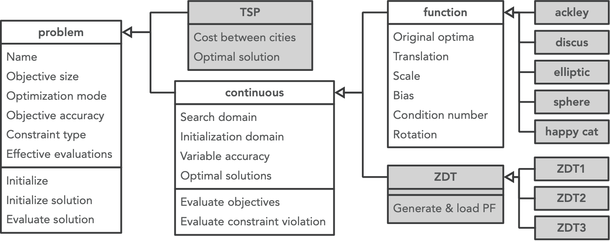
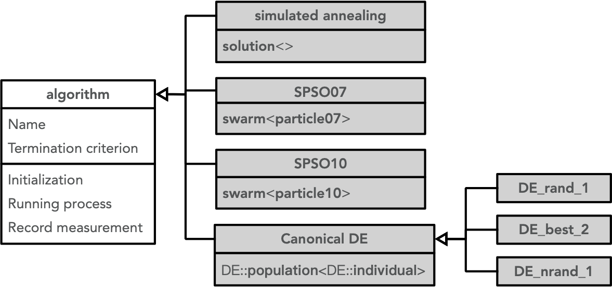
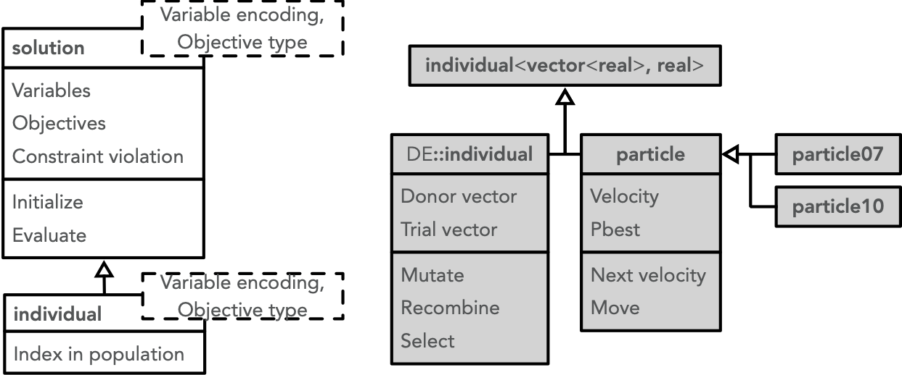
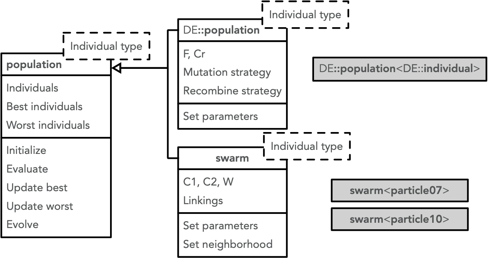

OFEC consists of four major components, i.e., problem, algorithm, measurement and utility. 

<object data="../../images/OFEC_component_diagram.svg" type="image/svg+xml"></object>

Algorithm calls problem to evaluate solutions, initialize solutions, check solutions' constraint violations or boundary violations. Algorithm also calls measurement to calculate and record necessary informations. Both algorithm, problem and measurement calls utility to help complete their operations.

## Problem
In OFEC, combinatorial problems are directly inherited from the base class `problem`, while most continuous problems in the platform are inherited from `problem`'s derived class `continuous`. Benchmark functions frequently transformed and used by composition problem have a common base class `function`, which is also derived from class `continuous`.

## Algorithm
All algorithm objects in OFEC must be defined as classes inherited from the base class `algorithm`. A single solution algorithm such as simulated annealing should own a solution class as data member, while population-based EAs should own the corresponding population class as data member.

The template class `solution` consists of decision variables, objective values, and constraint violation. The encoding of decision variables and the type of objective values are determined by its two template parameters. It can call the bound problem instance to initialize its decision variables or evaluate its objectives and constraint violation.

Derived from the template class `solution`, the template class `individual` can add an index to label its position in the population.

OFEC also defines the population as a template class, and the only template parameter is the individual type. This template parameter must be classes inherited from the template class `individual`.

