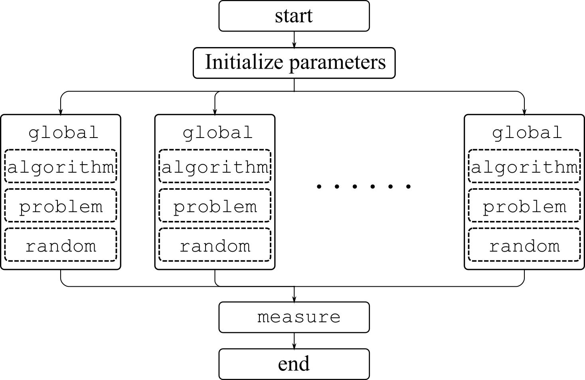

The work flow of OFEC can be explained by the figure below:

1. At the beginning of the program, initialize the experimental parameters, which determine the algorithm, the problem, the number of runs, the measurement interval, and so on.
1. For each run, generate a [`global`](../../Core/global) instance. All the instances run the same algorithm on the same problem but with different random generator seeds.
1. Each [`global`](../../Core/global) instance owns a independent [`algorithm`](../../Core/algorithm/algorithm) instance, a independent [`problem`](../../Core/problem/problem) instance, and of course a variety of independent [`random`](../../Utility/random) generator instances (e.g., gaussian, cauchy, and uniform). All the [`global`](../../Core/global) instances run in parallel.
1. An [`measure`](../../Core/measure) instance records the experimental results from all runs and outputs the statistics to two text files. And then the program ends.